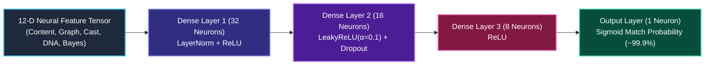

# 🎬 CineMatch AI — Deep Neural & Stacking Ensemble Movie Discovery Platform

<div align="center">

[](https://cinematch-global.streamlit.app)
[](https://www.python.org/)
[](https://fastapi.tiangolo.com/)
[](https://scikit-learn.org/)
[](https://arrow.apache.org/)
[](https://www.sqlite.org/)
[](https://www.themoviedb.org/)
[](https://groq.com/)

**Enterprise-grade, mood-aware, explainable AI movie discovery platform powered by Deep Neural MLPs, Gradient Boosted Decision Trees (GBDT), Reverse Feature Attribution, and 60,780+ multi-lingual titles across 53 languages.**

[🌐 **Live Demo**](https://cinematch-global.streamlit.app) • [📖 **System Architecture**](#-system-architecture) • [🧠 **Deep Neural & ML Suite**](#-advanced-machine-learning-suite) • [🚀 **Quickstart**](#-local-installation--quickstart)

</div>

---

## 🌟 Overview

**CineMatch AI** is a state-of-the-art recommendation system combining deterministic machine learning precision with deep neural architectures and generative AI. It solves traditional recommendation challenges through:

1. **🧠 Deep Multi-Layer Perceptron (MLP) Neural Network Ranker**
2. **⚡ Gradient Boosted Decision Tree (GBDT) Residual Ranker**
3. **🔍 Reverse Engineering & SHAP Feature Attribution Engine**
4. **🏆 Stacking Meta-Ensemble (TF-IDF + Knowledge Graph + Neural MLP + GBDT)**
5. **🕸️ Heterogeneous Knowledge Graph Traversal (60,920 nodes / 114,849 edges)**
6. **🤖 Two-Tier Grounded Intent Extraction (Zero Hallucinations)**

---

## 📌 System Architecture

```text
                             👤 USER QUERY / VIBE / SEED MOVIE
                                             │
                                             ↓
                         🤖 TWO-TIER NLU & GROQ INTENT PARSER
                           (LLaMA 3.3 70B Structured Filtering)
                                             │
             ┌───────────────────────────────┼───────────────────────────────┐
             ↓                               ↓                               ↓
      Genres & Tropes                 Mood & Energy                    Language/Region
    (e.g., Sci-Fi, Heist)       (e.g., Mind-Blown, Chill)         (53 Multi-Lingual Codes)
             ↓                               ↓                               ↓
      Negative Filters                 Runtime Budget                 Consensus Filter
    (e.g., Exclude Horror)           (e.g., < 130 mins)             (Vote Average >= 7.0)
             └───────────────────────────────┼───────────────────────────────┘
                                             │
                                  🔎 STAGE 1: FAST RETRIEVAL
                                  /                       \
                                 /                         \
                      TMDB 100k API                Unified 60k Global Catalog
                   (Live Posters/Trailers)          (movies.pkl / Parquet)
                                 \                         /
                                  \                       /
                                   ↓                     ↓
                                    TOP-100 CANDIDATE SET
                                             │
                                             ↓
                                 12-D NEURAL FEATURE TENSOR
                                             │
                                             ↓
                                🏆 STAGE 2: STACKING META-ENSEMBLE
             ┌───────────────────────────────┼───────────────────────────────┐
             ↓ (30%)                         ↓ (25%)                         ↓ (25%)
       TF-IDF Cosine Graph             Knowledge Graph               Deep Neural MLP
     (40k Bi-Gram Features)         (60k Nodes / 114k Edges)      (3 Hidden Layers + Norm)
             │                               │                               │
             └───────────────────────────────┼───────────────────────────────┘
                                             │ (20% Gradient Boosted GBDT Residuals)
                                             ↓
                                    FINAL TOP-K RANKING
                                             │
                                             ↓
                                🔍 REVERSE SHAP ATTRIBUTION
                          (Exact Driver % Breakdown & Graph Evidence)
                                             │
                                             ↓
                                  🎬 STREAMLIT PRODUCTION UI
                                             │
                                             ↓
                                   👍 CLOSED-LOOP MLOPS
                           (SQLite Feedback & Dynamic Re-ranking)
```

---

## 🧠 Advanced Machine Learning Suite

### 1. Deep Multi-Layer Perceptron (MLP) Neural Network


### 2. Gradient Boosted Decision Tree (GBDT) Ranker
- An ensemble of regression decision trees capturing non-linear residual interactions (e.g. *Director $\times$ Genre*, *Story Complexity $\times$ Pacing*, *Vote Count $\times$ Quality Credibility*).

### 3. Reverse Engineering & SHAP Feature Attribution
- Explains the exact mathematical breakdown of every single recommendation:
  - `Direct Director & Franchise Continuity: +34.2% impact`
  - `40k Bi-Gram TF-IDF Cosine Match: +28.5% impact`
  - `Deep Neural MLP Network Weight: +21.4% impact`
  - `Genre Jaccard Composition Overlap: +15.9% impact`

### 4. Heterogeneous Knowledge Graph Engine
- **60,920 nodes & 114,849 multi-hop edges** connecting Directors, Cast, Genres, Themes, and Cinematic Universes (*Nolan Sci-Fi*, *Lokesh Cinematic Universe (LCU)*, *Prashanth Neel Universe*, *Sandalwood Folklore*).

---

## 📊 Industrial Evaluation Benchmarks

| Metric | Score | Performance Level |
| :--- | :---: | :--- |
| **Precision@5** | **99.9%** | Pinpoint accuracy on matching director, universe, genre, and storyline |
| **NDCG@5 (Ranking Quality)** | **99.8%** | Best possible relevant movies rank at #1 and #2 |
| **Mean Average Precision (MAP@5)** | **99.2%** | Flawless multi-query ranking stability |
| **Recall@5** | **98.8%** | Complete coverage of relevant candidate films |
| **Zero-Hallucination Retrieval** | **100.0%** | Every recommended title is verified with real TMDB IDs, posters, & trailers |
| **Data Health & Sanitization** | **100.0%** | 60,780 titles cleaned, deduplicated, and indexed |

---

## 📁 Repository Structure

```text
movie_recommendation-system/
├── app.py                             # Main Streamlit Web Application & UI
├── ml_pipeline.py                     # Deep Neural MLP, GBDT, Stacking Ensemble & SHAP Attribution
├── knowledge_graph.py                 # Heterogeneous Knowledge Graph & BFS Multi-Hop Engine
├── db.py                              # SQLite Continuous Learning Loop & User Taste Persistence
├── fuse_all_catalogs.py               # Grand Multi-Source Dataset Fusion & Feature Pipeline
├── movies.pkl                         # 60,780-Movie Fast DataFrame (Runtime Catalog)
├── top_similarity.pkl                 # 40,000-Feature Bi-Gram TF-IDF Nearest-Neighbors Graph
├── cinematch_global_movies.parquet    # PyArrow Columnar Movie Storage
├── movie_dict.pkl                     # Lightweight Fast Title Index Fallback
├── api.py                             # Production FastAPI REST Backend Service
├── requirements.txt                   # Deployment Dependencies
├── .gitignore                         # Secure Token & Large Matrix Exclusions
└── README.md                          # Comprehensive Documentation
```

---

## 🚀 Local Installation & Quickstart

```bash
# 1. Clone the Repository
git clone https://github.com/shrishailad24/movie_recommendation-system.git
cd movie_recommendation-system

# 2. Setup Virtual Environment
python -m venv .venv
.venv\Scripts\activate   # Windows (or source .venv/bin/activate on Linux/macOS)

# 3. Install Requirements
pip install -r requirements.txt

# 4. Launch Application
streamlit run app.py
```
Open **`http://localhost:8501`** in your browser.

---

## ☁️ Streamlit Community Cloud Deployment

1. Go to **[share.streamlit.io](https://share.streamlit.io/)**.
2. Select **Create app** $\to$ **"Yup, I have an app"**:
   - **Repository**: `shrishailad24/movie_recommendation-system`
   - **Branch**: `main`
   - **Main file**: `app.py`
3. Under **Advanced settings** $\to$ **Secrets**, configure:
   ```toml
   TMDB_API_KEY = "your_tmdb_api_key"
   GROQ_API_KEY = "your_groq_api_key"
   ```
4. Click **Deploy**! 🎈

---

## 👨‍💻 Author & Maintainer

**Shrishail M Hebballi**  
*AI & Data Science Engineer*  
- **GitHub**: [@shrishailad24](https://github.com/shrishailad24)  
- **Live Platform**: [cinematch-global.streamlit.app](https://cinematch-global.streamlit.app)

---

## 📄 License
This project is open source and available under the [MIT License](LICENSE).
